# Evenza — University Event Management Platform

[](https://flask.palletsprojects.com/)
[](https://getbootstrap.com/)
[](https://opensource.org/licenses/MIT)

**Evenza** is a high-performance, full-stack event management ecosystem designed to streamline campus activities. It digitizes the entire event lifecycle—from discovery and secure QR-based ticketing to automated PDF certificate issuance.

---

## Project Preview:

### App Screenshots
| | |
| :---: | :---: |
| 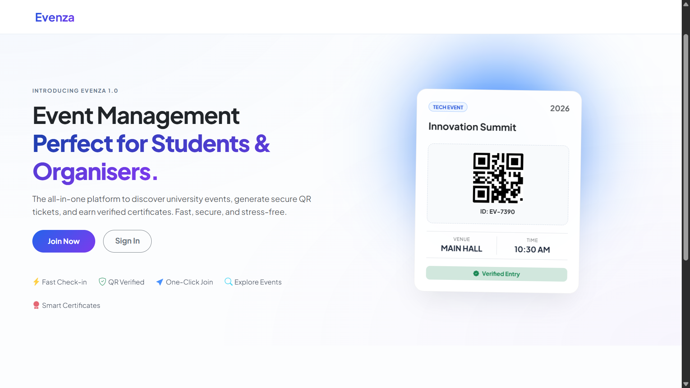 | 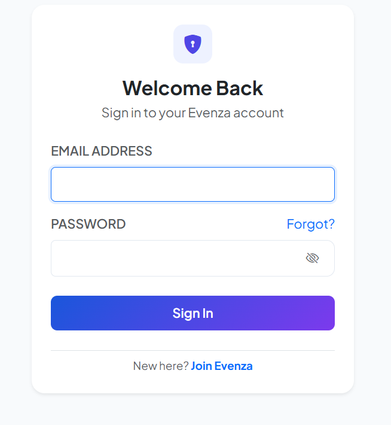 |
| 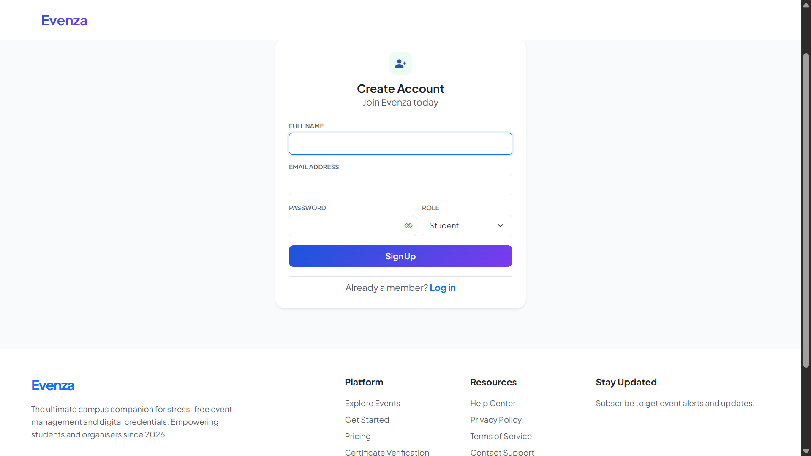 | 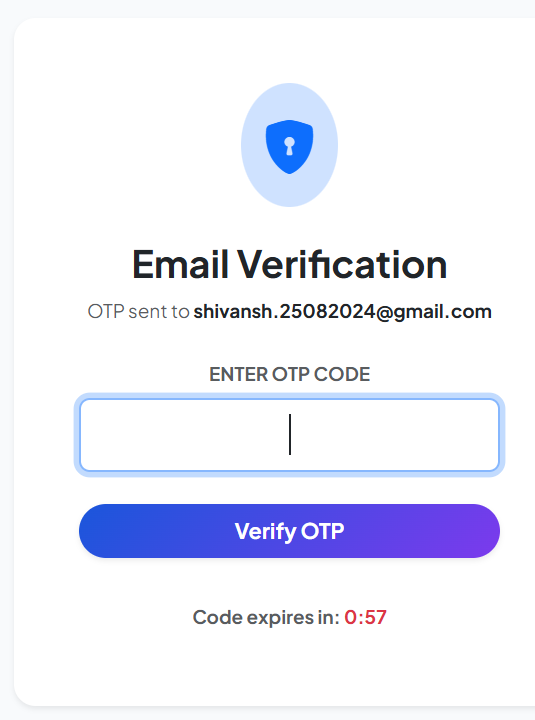 |
| 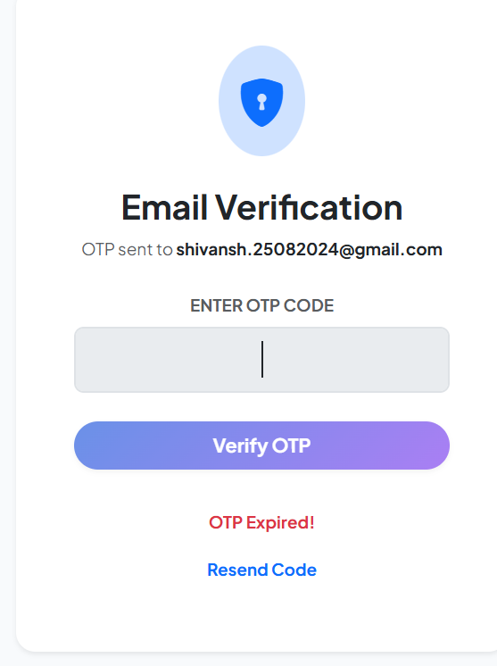 | 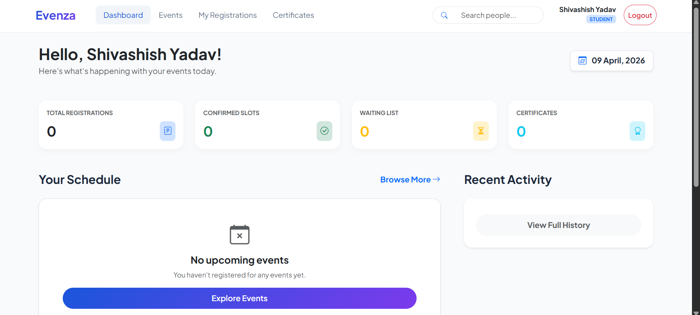 |
| 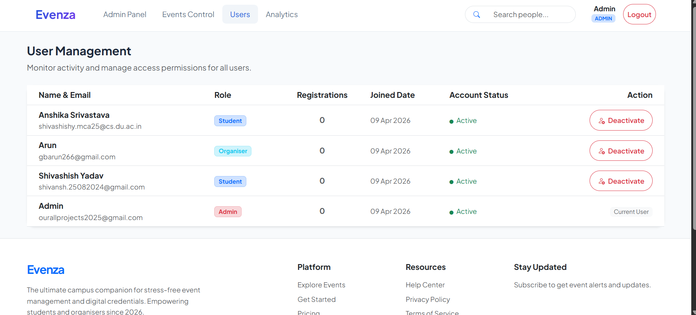 | 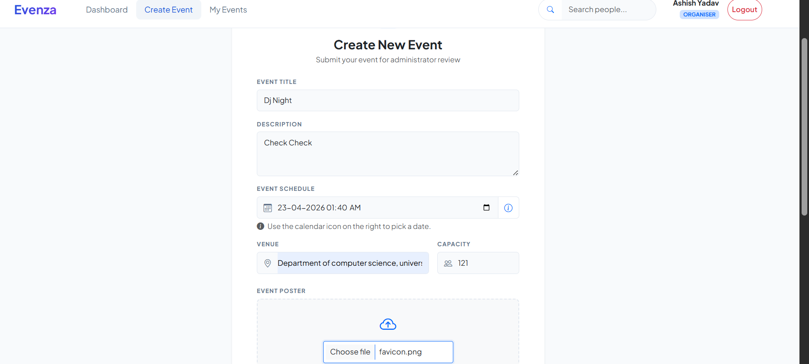 |
| 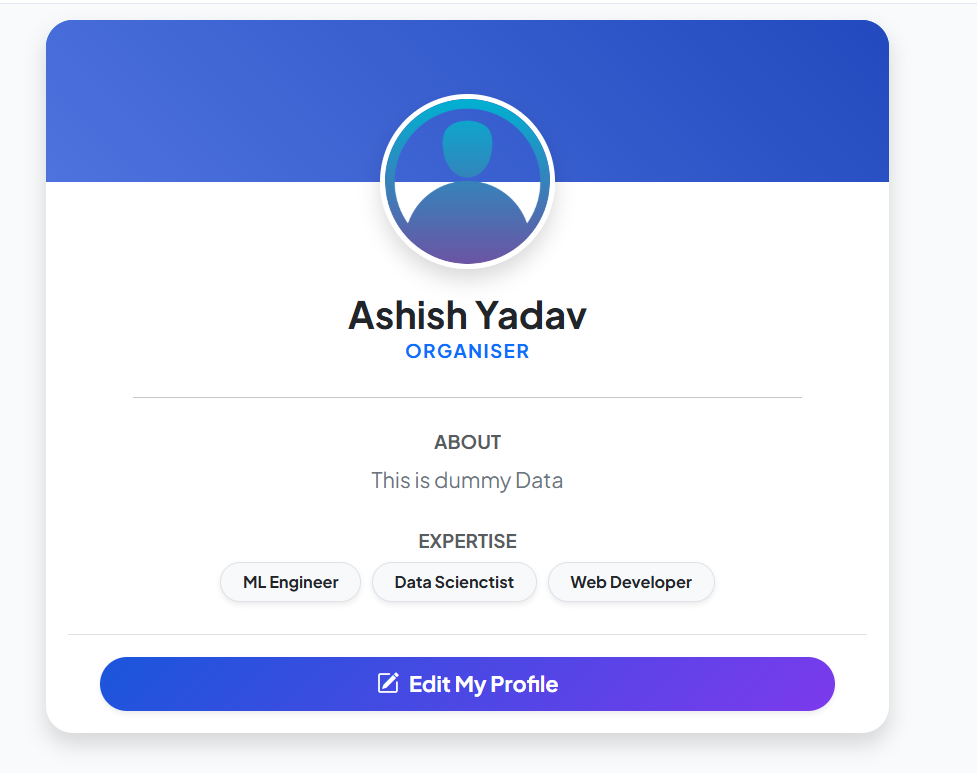 | 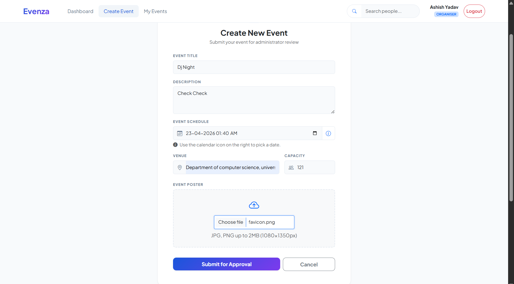 |
| 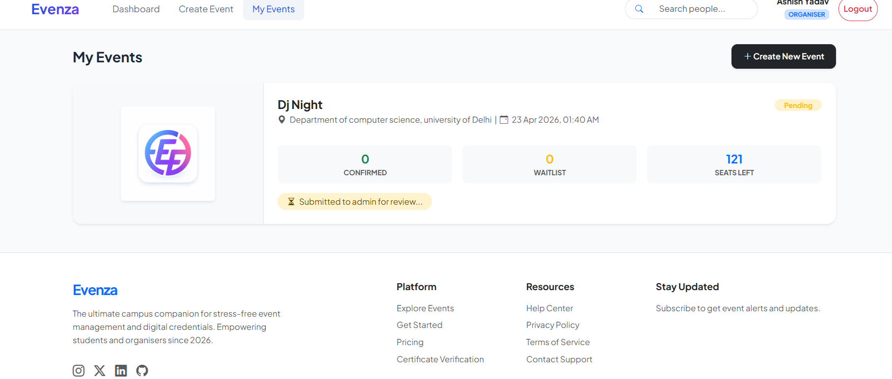 | 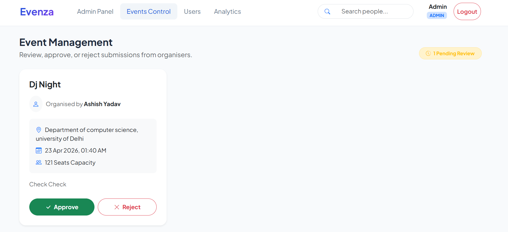 |
| 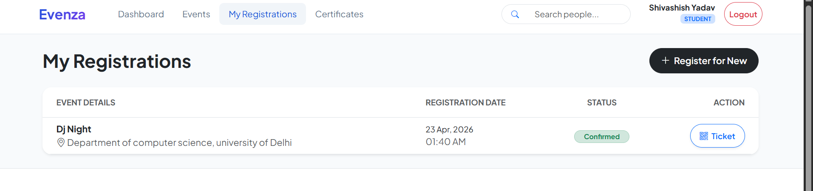 | 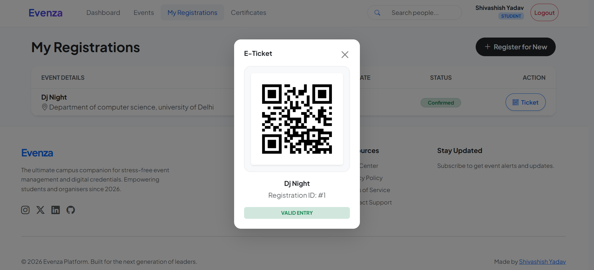 |
---

## Key Features

### RBAC (Role-Based Access Control)
* **Students:** Interactive dashboard to explore events, one-click registration, and a personal vault for digital certificates.
* **Organisers:** Comprehensive event management suite including attendee tracking, live registration metrics, and entry verification.
* **Admins:** Global platform oversight, user moderation, and system-wide analytics.

### Secure QR Verification
* **Unique Identity:** Each registration generates a dynamic QR code via the **`qrcode` Python library**.
* **Instant Check-in:** Organisers scan tickets for real-time authentication, eliminating manual entry errors and duplicate registrations.

### Automated Credentials
* **Dynamic Generation:** Automated issuance of PDF certificates using the **ReportLab** engine.
* **Digital Persistence:** Verified participants can download their credentials anytime directly from their profile.

---

## Tech Stack

* **Backend:** Python 3.x, Flask (Micro-framework)
* **Database:** SQLAlchemy (ORM), SQLite / PostgreSQL
* **Security:** Flask-Login (Session Management), Werkzeug (Password Hashing)
* **Frontend:** Bootstrap 5 (Modern SaaS UI), Jinja2 Templates
* **PDF/Media:** ReportLab, QRServer API

---

##  Installation & Setup

### 1. Clone the Repository
```bash
git clone [https://github.com/shivashishyadav/evenza.git](https://github.com/shivashishyadav/evenza.git)
cd evenza
```

---

### 2. Environment Configuration
```bash
# Create a virtual environment
python -m venv venv

# Activate (Windows)
venv\Scripts\activate

# Activate (macOS/Linux)
source venv/bin/activate

# Install dependencies
pip install -r requirements.txt
```

### 3. Initialize Database
```bash
python -c "from app import create_app, db; app = create_app(); app.app_context().push(); db.create_all()"
```

### 4. Launch Application
```bash
python run.py
```
Visit http://127.0.0.1:5000/ to view the platform.


---

##  Developer

**[Shivashish Yadav](https://www.linkedin.com/in/shivashishyadavv/)** [](https://www.linkedin.com/in/shivashishyadavv/)

---
*Developed for a more connected and efficient campus experience.*